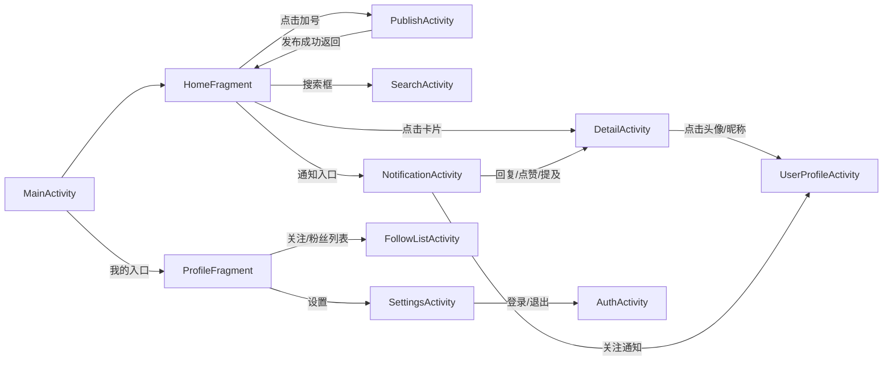
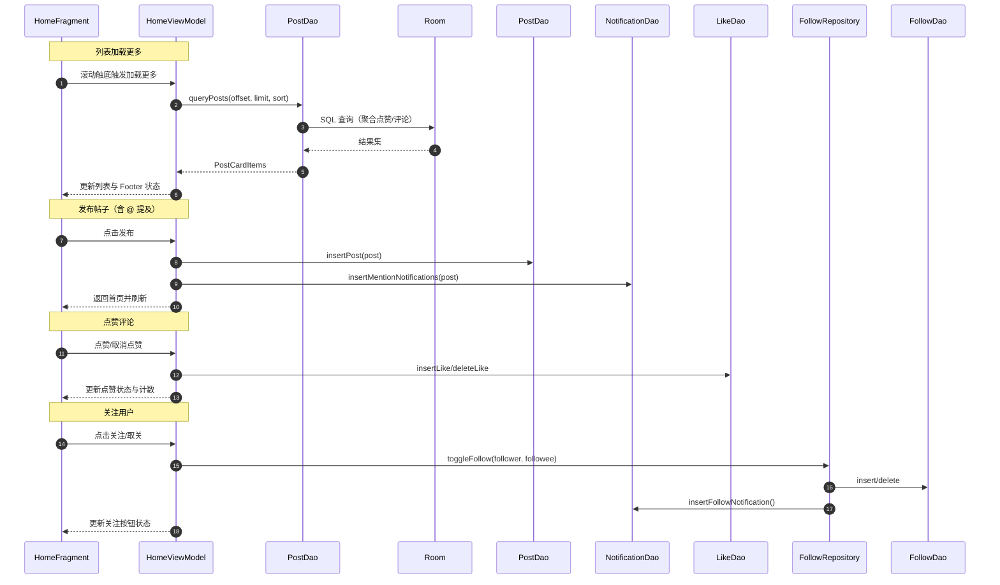

# UGCdemo（Android）

## 项目介绍
- 本项目为 2025 年字节跳动工程训练营客户端方向（TikTok Global Live-社交团队）作业项目。
- 目标：仿写小红书风格的 Android 客户端，完成首页瀑布流、详情页、发布页等核心功能，并以模块化、分层清晰的架构便于迭代与迁移。
- 下文首先给出作业“项目要求”，随后给出“已完成的项目文档”（技术设计、实现与优化说明、类图、工程目录等）。

## 项目要求
- 页面与能力
  - 首页（双列瀑布流）：展示帖子列表，具备加载更多、下拉刷新、出错重试、列表无数据等能力
  - 详情页：包含顶部栏（作者头像/昵称等）、内容区（图片/标题/正文等）、评论区（头像/昵称/评论内容等）
  - 发布页：支持相册图片选择、标题/正文文本编辑、发布；发布后返回列表页并能本地插入自己发布的帖子
- 交付产物
  - 技术设计文档：核心的类图以及代码架构图
  - Github 仓库源码：包含项目完整代码以及 git 提交记录
  - 效果演示视频：2 分钟内的录屏展示 App 的功能
- 加分项（示例）
  - 用到网络请求、多线程读写安全等
  - 页面跳转时有过渡动画效果
  - 选取合适的客户端架构（如 MVVM、MVP、MVC 等），工程模块组件划分合理
  - 能通过 Xcode、Android Studio 的工具分析 App 性能（FPS、CPU、内存等），并针对性的进行性能优化
- 要求
  - 每位同学独立完成自己的代码
  - 自选 iOS 或者 Android 的其中一端完成即可
  - 定期提交代码到 Github 上
- 提示
  - 数据可以通过本地数据库 SQLite 或者在线接口模拟网站进行 mock（如 `https://getman.cn/mock`）

---

# 已完成的项目文档

## 完成情况总览
- 必要要求（页面与能力）：
  - 双列瀑布流列表：已完成（推荐/关注双页，统一卡片样式）
  - 列表加载能力：已完成（加载更多、下拉刷新、列表无数据提示）
  - 出错重试：入口与状态位已设计并预留；当前以刷新与空态提示为主，待接入真实错误时展示重试
  - 详情页：已完成（顶部栏含作者头像/昵称，内容区含图片/标题/正文，评论区含头像/昵称/评论内容）
  - 发布页：已完成（相册图片选择、标题/正文编辑、发布后返回并在列表插入所发帖子）
- 拓展功能：
  - 搜索：笔记与用户搜索，支持最近/最多喜欢/最近评论排序与分页（用户搜索当前一次性结果，暂不分页）
  - 通知：提及/回复/点赞/关注四类通知，支持未读计数与标记已读（演示阶段允许“自提醒”）
  - 个人主页：我的/他人主页与关注/粉丝列表，双向关注状态合成按钮表现
  - 文本 @：正文/评论内 @ 用户名高亮可点击，跳转用户主页
  - 主题：多主题色选择与持久化
- 加分项完成情况：
  - 架构与模块：已完成（MVVM 分层、Room 持久化、Repository 封装）
  - 动效与过渡：已完成（按压缩放、波浪入场、圆形揭示、点赞弹跳与大心飞入、AppBar 渐隐）
  - 多线程与读写安全：已完成（固定线程池写入、LiveData 主线程分发、时间格式线程安全）
  - 性能与体验：已完成基础策略（分页节流、Footer 状态统一、轻量动画）；工具化分析可按需继续拓展
  - 网络请求：当前以本地数据源为主；分层良好，后续可迁移到在线数据源

## 设计思想
- 数据驱动：采用 MVVM 与 Room，所有页面通过 LiveData 订阅数据源，实现低耦合的单向数据流。
- 分页统一：分页、排序、刷新等列表通用逻辑收敛到各页面 ViewModel 中，列表适配器只负责渲染与轻交互。
- 乐观交互：点赞、关注、评论发送等操作优先给用户正确的即时反馈（动画与状态），后台异步落库并与 UI 同步。
- 平滑过渡：通过统一的按压缩放、进入动画、AppBar 渐隐与圆形揭示等过渡效果，确保体验一致且轻量。
- 数据源抽象：当前以本地 Room 为主；接口分层清晰（UI→ViewModel→Repository/DAO），后续可平滑迁移到在线数据源。

## 架构与模块
- UI 层：Activity/Fragment + RecyclerView.Adapter，负责页面布局、轻交互与动画展示。
- ViewModel 层：参数状态（tab/sort/offset/hasMore/loading）、数据拉取（分页/刷新）、用户操作（点赞/关注/发布/删除/搜索/标记已读）。
- 数据层：Room（Entity/Dao），仓库（关注关系与通知写入）。写入统一通过固定线程池，避免主线程阻塞。

## 视觉与交互风格
- 样式：卡片化与大留白，强调图片/标题为入口；正文与评论采用可读的间距与层级。
- 触感：所有主要点击位统一接入“按压缩放”反馈；列表项入场以淡入+位移确保自然，不影响滑动性能。
- 层级：详情页顶部栏简洁，图片区域使用 ViewPager2 与 Tab 指示器；评论作为二级内容放置于正文之后。

## 加载与分页策略
- 触发条件：监听列表滚动到距离底部 3 项时触发下一页，使用 700ms 节流防抖。
- 状态管理：ViewModel 维护 `offset/hasMore/loading`；Footer 呈现“正在加载/没有更多/空列表”。
- 模拟延迟：分页加载插入固定 700ms 延迟，模拟网络时序，便于调试交互与动画节律。
- 排序：支持“最近发表/最多喜欢/最近评论”；DAO 层聚合统计（likeCount/commentCount/lastCommentTime）。
- 关注流 vs 推荐流：两个页面独立维护分页状态，关注页基于关注关系过滤后排序。

## 列表空态、错误与重试
- 空态：Footer 显示场景化提示并提供入口操作（如“去发布试试”）。
- 错误：建议在接入网络后统一捕获分页异常并在 Footer 提供“重试”操作；当前结构已预留该呈现位（错误态文案与按钮可在 Footer 复用）。
- 刷新：统一使用 `SwipeRefreshLayout` 重置分页状态并重新加载。

## 动画设计
- 列表项入场：淡入与小幅位移的波浪式入场，按位置错峰，避免两列不同步造成割裂感。
- 按压缩放：按下缩放至 0.95、抬起恢复；时长 100ms；不拦截点击。
- 发布入口过渡：圆形揭示入场/退出，强调动效与操作因果。
- 点赞反馈：三段弹跳与“大心飞入”，评论点赞小振幅缩放。
- AppBar 渐隐：折叠到 90% 后显现 Toolbar 头像/昵称，默认标题初段即淡出。

## 文本高亮与 @ 提及
- 解析规则：识别 `@中文/字母/数字/下划线`，转为可点击高亮。
- 跳转：携带用户名跳转用户主页，主页解析并定位到用户 ID；不存在则提示并返回。
- 通知：发布/评论解析到的被提及用户名尝试匹配用户并写入“提及”通知；匹配不到不通知但保留高亮。

## 发布流程与交互
- 图片选择：最多 9 张，卡片化预览与计数标识，支持删除与继续添加。
- 文本编辑：标题加粗、正文多行，输入框风格统一。
- 发布：插入帖子与 @ 通知；返回首页自动刷新，滚动到顶部查看最新内容。

## 搜索与排序
- 笔记搜索：标题/正文包含匹配，三种排序，分页与节流与首页一致。
- 用户搜索：用户名包含匹配；一次性结果展示，关注/取关与状态同步。
- 排序交互：统一弹出菜单样式，选中后即时刷新。

## 通知体系
- 类型：提及（mention）、回复（reply）、点赞（like）、关注（follow）。
- 行为：发布/评论/点赞/关注在后台线程写入通知；列表按类型筛选并支持“全部标记为已读”。
- 跳转：关注跳转用户主页，其他跳转帖子详情并可根据 `extra_id` 定位评论。
- 规则说明：演示阶段允许“自提醒”，用于完整展示通知流与未读计数。

## 关注关系与个人主页
- 关系维护：仓库封装关注/取关；取关→关注写入“关注”通知。
- 主页视图：我的/他人主页两标签（发布/赞过），显示关注数/粉丝数；按钮根据双向关系合成状态。
- 滚动体验：双列瀑布流与分页，滚动末尾触发加载更多，空态提供引导与入口操作。

## 主题系统与视觉统一
- 主题色：多主题色选择与持久化；进入页面自动应用。
- 视觉统一：输入框、按钮、Badge、阴影、圆角等统一资源与尺寸。

## 数据与存储
- Room 表：`User`、`Post`、`Comment`、`Like`、`Follow`、`Notification`。
- 聚合统计：帖子卡片查询同时计算点赞数、评论数与最近评论时间；评论列表按根评论分页并展平子回复。
- 线程池写入：统一在固定线程池执行写操作，读通过 LiveData 主线程分发。

## 迭代与迁移（数据源）
- 当前使用 Room（本地 SQLite）作为主要数据源，利于离线开发与快速迭代。
- 如需接入在线接口，只需在 Repository 或 DAO 抽象位置替换实现；得益于分层接口设计，UI 与 ViewModel 可保持不变。

## 后端设计图（数据库结构 ER 图）
```mermaid
erDiagram
    USER {
        long user_id PK
        string username
        string password
        string avatar_path
        long register_time
    }
    POST {
        long post_id PK
        long author_id FK
        string title
        string content
        string image_path
        long publish_time
    }
    COMMENT {
        long comment_id PK
        long post_id FK
        long author_id FK
        string content
        long comment_time
        long parent_comment_id
        string reply_to_username
    }
    LIKE {
        long id PK
        long user_id FK
        int target_type
        long target_id
        long create_time
    }
    FOLLOW {
        long id PK
        long follower_id FK
        long followee_id FK
        long create_time
    }
    NOTIFICATION {
        long id PK
        int type
        long target_user_id FK
        long source_user_id FK
        long related_id
        long extra_id
        string content_preview
        boolean is_read
        long created_at
    }

    USER ||--o{ POST : authors
    POST ||--o{ COMMENT : has
    USER ||--o{ COMMENT : writes
    COMMENT ||--o{ COMMENT : replies
    USER ||--o{ LIKE : makes
    POST ||--o{ LIKE : likedBy (type=0)
    COMMENT ||--o{ LIKE : likedBy (type=1)
    USER ||--o{ FOLLOW : follows
    USER ||--o{ FOLLOW : followedBy
    USER ||--o{ NOTIFICATION : target
    USER ||--o{ NOTIFICATION : source
    POST ||--o{ NOTIFICATION : relates
    COMMENT ||--o{ NOTIFICATION : extra
```

## 前端设计图（页面关系与导航）


## 前后端交互图（关键流程 Sequence）


## 项目文件结构目录表
```
UGCdemo/                                 - 工程根目录
├─ app/                                  - 应用模块（主工程代码与资源）
│  ├─ src/                               - 源码根目录
│  │  ├─ main/                           - 主源集（应用运行时的代码与资源）
│  │  │  ├─ java/com/bytecamp/herbit/ugcdemo/ - 应用 Java 包根
│  │  │  │  ├─ data/                     - 数据层与数据库入口
│  │  │  │  │  └─ AppDatabase.java       - Room 数据库与线程池配置
│  │  │  │  ├─ ui/                       - UI 层（页面、对话框、适配器）
│  │  │  │  │  ├─ HomeFragment.java      - 首页（推荐/关注双页与瀑布流）
│  │  │  │  │  ├─ DetailActivity.java    - 帖子详情页（图片/正文/评论）
│  │  │  │  │  ├─ PublishActivity.java   - 发布页（图片选择与文本编辑）
│  │  │  │  │  ├─ NotificationActivity.java - 通知列表与跳转
│  │  │  │  │  ├─ SearchActivity.java    - 搜索页（笔记/用户与排序）
│  │  │  │  │  ├─ ProfileFragment.java   - 我的主页（发布/赞过）
│  │  │  │  │  ├─ UserProfileActivity.java - 他人主页与关注关系
│  │  │  │  │  ├─ PostsAdapter.java      - 帖子卡片列表适配器
│  │  │  │  │  ├─ CommentsAdapter.java   - 评论与子回复展示适配器
│  │  │  │  │  └─ NotificationAdapter.java - 通知列表适配器
│  │  │  │  ├─ util/                     - 工具与统一交互效果
│  │  │  │  │  ├─ AnimUtils.java         - 按压缩放等通用动效
│  │  │  │  │  ├─ SpanUtils.java         - 文本高亮与 @ 跳转
│  │  │  │  │  ├─ ThemeUtils.java        - 主题色切换与持久化
│  │  │  │  │  └─ TimeUtils.java         - 时间格式化与线程安全
│  │  │  │  ├─ viewmodel/                - 页面状态与业务操作
│  │  │  │  │  ├─ HomeViewModel.java     - 首页分页、排序与状态
│  │  │  │  │  ├─ DetailViewModel.java   - 详情/评论分页、点赞与通知
│  │  │  │  │  ├─ PublishViewModel.java  - 发布逻辑与提及处理
│  │  │  │  │  ├─ SearchViewModel.java   - 搜索分页与排序
│  │  │  │  │  ├─ ProfileViewModel.java  - 我的主页数据与分页
│  │  │  │  │  ├─ UserProfileViewModel.java - 他人主页与关注状态
│  │  │  │  │  ├─ NotificationViewModel.java - 通知数据与已读状态
│  │  │  │  │  └─ AuthViewModel.java     - 登录注册与校验
│  │  │  │  ├─ MainActivity.java         - 主页面与底部导航
│  │  │  │  ├─ AuthActivity.java         - 登录注册页面
│  │  │  │  ├─ SettingsActivity.java     - 设置与主题切换
│  │  │  │  └─ FollowListActivity.java   - 关注/粉丝列表页
│  │  │  ├─ res/                         - 资源目录（布局、图片、样式等）
│  │  │  │  ├─ layout/                   - 页面与项布局 XML
│  │  │  │  │  ├─ activity_main.xml      - 主页面布局（底部导航）
│  │  │  │  │  ├─ fragment_home.xml      - 首页框架（Tab 与 ViewPager2）
│  │  │  │  │  ├─ page_home_list.xml     - 首页列表页（瀑布流与刷新）
│  │  │  │  │  ├─ item_post.xml          - 帖子卡片布局
│  │  │  │  │  ├─ item_list_footer.xml   - 列表 Footer（加载/空态）
│  │  │  │  │  ├─ activity_detail.xml    - 帖子详情布局
│  │  │  │  │  ├─ item_comment.xml       - 根评论项布局
│  │  │  │  │  ├─ item_comment_reply.xml - 子回复项布局
│  │  │  │  │  ├─ activity_publish.xml   - 发布页布局
│  │  │  │  │  ├─ activity_search.xml    - 搜索页布局
│  │  │  │  │  ├─ activity_notification_list.xml - 通知列表布局
│  │  │  │  │  ├─ activity_user_profile.xml - 他人主页布局
│  │  │  │  │  ├─ fragment_profile.xml   - 我的主页布局
│  │  │  │  │  └─ activity_settings.xml  - 设置页布局
│  │  │  │  ├─ drawable/                 - 形状/选择器/占位图等资源
│  │  │  │  ├─ color/                    - 颜色资源与主题色定义
│  │  │  │  ├─ anim/                     - 过渡与入场动画 XML
│  │  │  │  ├─ menu/                     - 菜单资源（底部导航等）
│  │  │  │  ├─ mipmap-*/                 - 启动图标资源
│  │  │  │  ├─ values/                   - 文本/尺寸/样式/主题等
│  │  │  ├─ AndroidManifest.xml          - 应用清单（权限、Activity 声明）
│  │  ├─ test/                           - 单元测试源码
│  │  │  └─ java/... ExampleUnitTest.java - 示例单测入口
│  │  └─ androidTest/                     - 仪器测试源码
│  │     └─ java/... ExampleInstrumentedTest.java - 示例仪测入口
│  ├─ build.gradle.kts                    - 模块级构建脚本（依赖与插件）
│  └─ proguard-rules.pro                  - 混淆规则
├─ gradle/                                - Gradle 配置与包装器
│  └─ wrapper/                            - Wrapper（版本与下载配置）
├─ settings.gradle.kts                    - 工程设置（模块包含关系）
├─ build.gradle.kts                       - 根构建脚本（版本与仓库）
├─ gradle.properties                      - Gradle 属性（内存、代理、版本）
├─ gradlew / gradlew.bat                  - Gradle 脚本（Unix/Windows）
└─ README.md                              - 本文档
```
